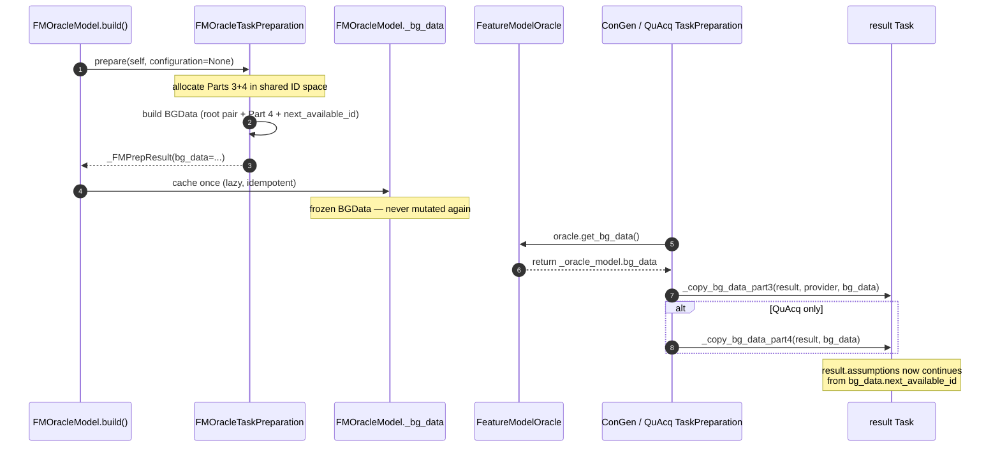
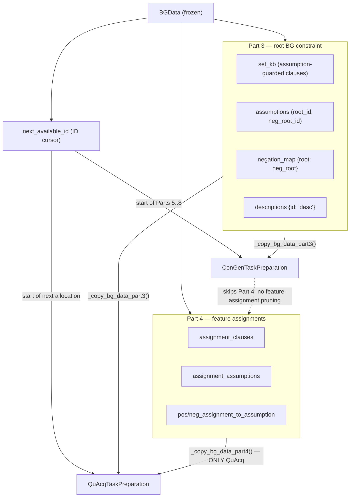

# Visual Explanation: bg_data

## Overview

`bg_data` is an instance of **`BGData`** — a `frozen=True` dataclass that acts as the
**background-knowledge bridge** from the *Oracle* (the feature-model SAT authority)
to the *constraint-acquisition algorithms* (ConGen, QuAcq).

It exists to solve one concrete problem: ConGen and QuAcq both build their own
assumption-guarded KB, but both must **start from the same root background knowledge**
(the FM root constraint) and **continue allocating assumption IDs without collisions**.
Rather than re-deriving that from the Oracle (or worse, mutating the Oracle's model),
the Oracle computes it **once** and ships it across as an immutable `BGData` packet.

- **Definition:** `conacq/oracle/bg_data.py:13` (`@dataclass(frozen=True) class BGData`)
- **Producer:** `FMOracleTaskPreparation.prepare()` → `fm_oracle_model.py:240`
- **Accessor:** `FeatureModelOracle.get_bg_data()` → `fm_oracle.py:127`
- **Consumers:** `ConGenTaskPreparation` (Part 3 only), `QuAcqTaskPreparation` (Parts 3+4)

---

## Quick View (ASCII)

```
        PRODUCER (Oracle side)                CARRIER (immutable)            CONSUMERS (algorithm side)
 ┌───────────────────────────────────┐                                ┌──────────────────────────────────┐
 │ FMOracleTaskPreparation.prepare()  │      ┌──────────────────┐      │ ConGenTaskPreparation.prepare()    │
 │  builds shared ID layout Parts 3+4 │      │     BGData       │  ──► │   _copy_bg_data_part3()  (root BG) │
 │  fm_oracle_model.py:240            │ ───► │  (frozen=True)   │      │   acqmss/task_preparation.py:95    │
 └───────────────┬───────────────────┘      │                  │      └──────────────────────────────────┘
                 │ cached lazily             │  set_kb          │      ┌──────────────────────────────────┐
                 ▼                           │  assumptions     │  ──► │ QuAcqTaskPreparation.prepare()     │
 ┌───────────────────────────────────┐      │  negation_map    │      │   _copy_bg_data_part3()  (root BG) │
 │ FMOracleModel._bg_data            │      │  descriptions    │      │   _copy_bg_data_part4()  (assigns) │
 │  fm_oracle_model.py:113           │      │  next_available  │      │   quacq/task_preparation.py:104    │
 └───────────────┬───────────────────┘      │  ─ Part 4 ─      │      └──────────────────────────────────┘
                 │ exposed via               │  assignment_*    │
                 ▼                           └──────────────────┘       Copy helpers live ONCE in the mixin:
 ┌───────────────────────────────────┐                                 OracleAwareTaskPreparation
 │ Oracle.get_bg_data() -> BGData    │      typed minimally via         (oracle_aware_task_preparation.py)
 │  fm_oracle.py:127                 │      BGDataProvider Protocol
 └───────────────────────────────────┘      (bg_data.py:43)


  Shared Assumption-ID Layout  (one number line, 8 parts, no overlaps)
  ════════════════════════════════════════════════════════════════════════════════════════
   Part 1   Part 2      Part 3                Part 4              Part 5..8
   feat IDs Tseitin     FM-constraint pairs   feature-assign      bias / E+ / NE
   1..n     (neg FM)    [root,¬root, c2,¬c2]   [f1=T,f1=F, ...]    (ConGen owns these)
            └─ FmToDiagPysat ─┘   └──────── FMOracleTaskPreparation ────────┘ └ ConGen/QuAcq ┘
                                   ▲                     ▲              ▲
                                   │                     │              │
                         BGData.assumptions    BGData.assignment_*   BGData.next_available_id
                         (first pair only)     (all of Part 4)       (= first free ID after Part 4)
```

**Read it as:** the Oracle owns Parts 1–4 of a single shared ID space; `BGData` snapshots
the *root pair* of Part 3 + *all* of Part 4 + the **cursor** (`next_available_id`) marking
where Parts 5–8 may safely begin.

---

## Detailed Flow

### Lifecycle (build → cache → consume)



### What each consumer copies



---

## Key Concepts

1. **Immutable carrier (`frozen=True`)** — `BGData` (`bg_data.py:13`) can never be edited
   after the Oracle creates it. Consumers *copy out of it* into their own `result` Task;
   they never write back. This is what lets the Oracle model stay a pure, side-effect-free
   KB (`fm_oracle_model.py` docstring: *"the model is never mutated"*).

2. **Shared assumption-ID layout (8 parts)** — every SAT-assumption literal lives in one
   global number line split into 8 disjoint parts. The Oracle owns Parts 1–4
   (`fm_oracle_model.py:160`); ConGen owns Parts 5–8 (`acqmss/task_preparation.py:79`).
   `BGData` is the handshake at the Part-4/Part-5 boundary.

3. **`next_available_id` = the cursor** — the single most important field. It tells the
   consumer the first ID not yet used, so `prepare_kb` / `prepare_testsuite_with_negation`
   continue allocating **collision-free** (`acqmss/task_preparation.py:100`).

4. **Part 3 vs Part 4 split (DRY divergence)** — both algorithms need Part 3 (root BG),
   so `_copy_bg_data_part3` lives once in the `OracleAwareTaskPreparation` mixin
   (`oracle_aware_task_preparation.py:31`). Only QuAcq does feature-assignment pruning,
   so `_copy_bg_data_part4` is QuAcq-only (`oracle_aware_task_preparation.py:53`).

5. **`BGDataProvider` Protocol** — preparations only need `get_bg_data()`, so they
   type-check against the minimal `BGDataProvider` Protocol (`bg_data.py:43`) instead of
   the concrete oracle — interface segregation in action.

6. **Not every oracle has it** — `BGData` is feature-model-specific. `UserPromptOracle`
   (`user_prompt.py:115`) and the base oracle return `Optional[BGData] = None`;
   `CachedOracle` (`cached.py:77`) delegates. Only `FeatureModelOracle` produces a real one.

---

## Code Example

The producer builds `bg_data` at the Part-3/Part-4 boundary, snapshotting exactly
the root pair + all assignment data + the ID cursor:

```python
# conacq/oracle/fm_oracle_model.py:240  (FMOracleTaskPreparation.prepare)
bg_data = BGData(
    set_kb=result.set_kb[:2],                      # first pair = root constraint clauses
    assumptions=(result.assumptions[0],            # (root_id, neg_root_id)
                 result.assumptions[1]),
    negation_map={result.assumptions[0]: result.assumptions[1]},
    descriptions=provider.get_descriptions_for(
        [result.assumptions[0], result.assumptions[1]]),
    next_available_id=id_assumption,               # ← the cursor: first free ID after Part 4
    # Part 4 (consumed by QuAcq only)
    assignment_clauses=assignment_clauses,
    assignment_assumptions=assignment_assumptions,
    pos_assignment_to_assumption=dict(pos_assignment_to_assumption),
    neg_assignment_to_assumption=dict(neg_assignment_to_assumption),
)
```

The consumer pulls it and copies Part 3 into a fresh task, then keeps allocating
from the cursor:

```python
# conacq/algorithms/acqmss/task_preparation.py:95  (ConGenTaskPreparation.prepare)
bg_data = oracle.get_bg_data()                     # immutable packet from the Oracle
self._copy_bg_data_part3(result, provider, bg_data)  # root BG → result (mixin, shared)

bias_start_pos = len(result.assumptions)
id_assumption = model.next_available_id            # ConGen continues its own Part 5..8
id_assumption = prepare_kb(result, provider, model.constraint_map,
                           id_assumption, model.negated_constraint_map)
```

And the shared copy helper — the single home for the Part-3 copy logic:

```python
# conacq/algorithms/oracle_aware_task_preparation.py:31
@staticmethod
def _copy_bg_data_part3(result, provider, bg_data):
    result.set_kb.extend(bg_data.set_kb)
    result.assumptions.extend(list(bg_data.assumptions))
    result.negation_map.update(bg_data.negation_map)
    for aid, desc in bg_data.descriptions.items():
        provider.add_constraint_description(aid, desc)
```

---

*Source-of-truth files:* `conacq/oracle/bg_data.py` · `conacq/oracle/fm_oracle_model.py`
· `conacq/oracle/fm_oracle.py` · `conacq/algorithms/oracle_aware_task_preparation.py`
· `conacq/algorithms/acqmss/task_preparation.py` · `conacq/algorithms/quacq/task_preparation.py`
