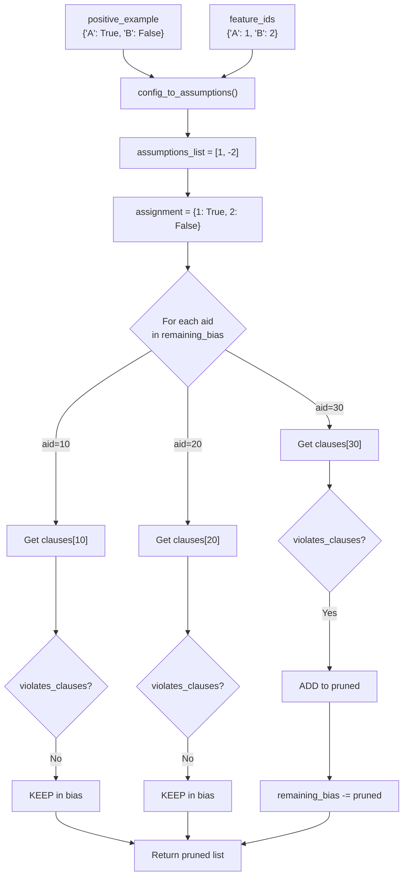

# Visual Explanation: `_prune_rejecting_constraints`

## Overview

This method removes constraints from the **remaining bias** that are inconsistent with a **positive example** (a valid configuration confirmed by the oracle). If a constraint rejects a valid configuration, it cannot be part of the target constraint network — so it's pruned.

**Location:** `conacq/algorithms/quacq/quacq.py:290-307`

## Quick View (ASCII)

```
                    _prune_rejecting_constraints
  ┌──────────────────────────────────────────────────────────┐
  │                                                          │
  │  INPUTS                                                  │
  │  ──────                                                  │
  │  positive_example: {"A": True, "B": False, "C": True}   │
  │  feature_ids:      {"A": 1, "B": 2, "C": 3}             │
  │  remaining_bias:   {10, 20, 30, 40}  (assumption IDs)    │
  │  constraint_clauses: {10: [[1,-2]], 20: [[-1,3]], ...}   │
  │                                                          │
  │  STEP 1: Convert config → SAT literals                   │
  │  ─────────────────────────────────────────                │
  │  {"A":T, "B":F, "C":T} → [1, -2, 3]                     │
  │                            ↓                             │
  │  assignment = {1: True, 2: False, 3: True}               │
  │                                                          │
  │  STEP 2: Check each constraint against assignment        │
  │  ────────────────────────────────────────────             │
  │                                                          │
  │  aid=10  clauses=[[1,-2]]   → satisfied? ✅ KEEP         │
  │  aid=20  clauses=[[-1, 3]]  → satisfied? ✅ KEEP         │
  │  aid=30  clauses=[[2]]      → satisfied? ❌ VIOLATED     │
  │  aid=40  clauses=[[-3]]     → satisfied? ❌ VIOLATED     │
  │                                                          │
  │  STEP 3: Remove violated constraints from bias           │
  │  ───────────────────────────────────────────              │
  │  remaining_bias: {10, 20, 30, 40} → {10, 20}            │
  │  pruned: [30, 40]                                        │
  │                                                          │
  └──────────────────────────────────────────────────────────┘
```

## Detailed Flow



## Key Concepts

### 1. Why Prune on Positive Examples?

In QuAcq, the oracle confirms a query (configuration) as **valid** — meaning it satisfies all target constraints. Any candidate constraint that **rejects** this valid configuration is definitively wrong and can be eliminated.

```
Oracle says: "Config X is VALID"
Constraint C rejects Config X  →  C is NOT a target constraint  →  PRUNE C
```

### 2. SAT-Level Clause Checking

Each constraint is encoded as CNF clauses (lists of literal lists). A constraint **violates** the assignment if any of its clauses is unsatisfied — meaning none of the clause's literals match the assignment.

```python
# Clause [-1, 3] with assignment {1: True, 3: True}
# lit=-1 → var=1, need NOT assignment[1] → need False, got True → ✗
# lit=3  → var=3, need assignment[3]     → need True, got True  → ✓
# Clause SATISFIED → constraint NOT violated
```

### 3. Where It Fits in QuAcq's Main Loop

```
┌─────────────────────────────────────────────────┐
│  QuAcq Main Loop (learn)                        │
│                                                 │
│  1. Generate query from remaining_bias          │
│  2. Ask oracle: is query valid?                 │
│     ├─ YES → _prune_rejecting_constraints() ◄──┤
│     └─ NO  → find_scope() → find_c()           │
│  3. Repeat until bias empty or converged        │
│                                                 │
└─────────────────────────────────────────────────┘
```

When oracle answers **YES**, we prune. When oracle answers **NO**, we use `find_scope` + `find_c` to **learn** a new constraint.

### 4. Performance Note

The method is decorated with `@count_calls('prune_calls')` — its invocation count is tracked in the profiler, since pruning efficiency directly impacts how quickly the bias shrinks and the algorithm converges.
