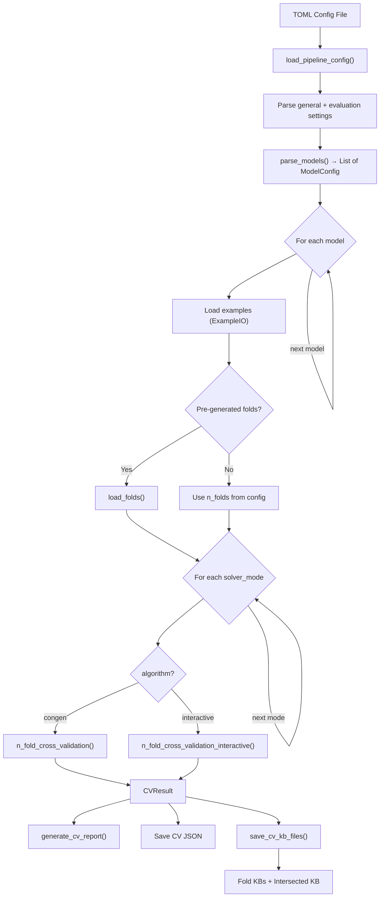

# Visual Explanation: `run_cv.py`

## Overview

`run_cv.py` is the unified **n-fold cross-validation** runner for the AcqMSS project. It evaluates constraint acquisition algorithms (ConGen or Interactive) by splitting examples into folds, running acquisition on each fold, and producing per-fold + intersected knowledge bases (KBs).

## Quick View (ASCII)

```
                          run_cv.py Pipeline
 ┌──────────────────────────────────────────────────────────────┐
 │                                                              │
 │  ┌──────────┐    ┌────────────┐    ┌───────────────────┐    │
 │  │  TOML    │───>│  Parse     │───>│  For each Model   │    │
 │  │  Config  │    │  Settings  │    │  ┌───────────────┐ │    │
 │  └──────────┘    └────────────┘    │  │ Load Examples │ │    │
 │                                    │  │ Load Folds    │ │    │
 │                                    │  └───────┬───────┘ │    │
 │                                    │          │         │    │
 │                                    │          v         │    │
 │                                    │  ┌───────────────┐ │    │
 │                                    │  │ For each      │ │    │
 │                                    │  │ Solver Mode   │ │    │
 │                                    │  │ (inc/non-inc) │ │    │
 │                                    │  └───────┬───────┘ │    │
 │                                    │          │         │    │
 │                                    │     ┌────┴────┐    │    │
 │                                    │     v         v    │    │
 │                                    │  ConGen  Interactive│    │
 │                                    │     │         │    │    │
 │                                    │     └────┬────┘    │    │
 │                                    │          v         │    │
 │                                    │  ┌───────────────┐ │    │
 │                                    │  │ Save Results  │ │    │
 │                                    │  │ - CV JSON     │ │    │
 │                                    │  │ - Fold KBs    │ │    │
 │                                    │  │ - Intersected │ │    │
 │                                    │  └───────────────┘ │    │
 │                                    └───────────────────┘    │
 └──────────────────────────────────────────────────────────────┘
```

## Detailed Flow



## Key Concepts

### 1. Configuration (TOML)

The config has 3 sections:

| Section | Purpose | Key Fields |
|---------|---------|------------|
| `[general]` | Global settings | `seed`, `output_dir`, `verbose` |
| `[evaluation]` | CV parameters | `algorithm`, `n_folds`, `solver_mode`, `shuffle_bias` |
| `[[models]]` | Model definitions (array) | `name`, `oracle`, `bias`, `examples`, `folds_path` |

### 2. Two Algorithm Paths

```
ConGen path:      pos/neg examples  →  n_fold_cross_validation()
Interactive path:  pos/neg examples + bias clauses  →  n_fold_cross_validation_interactive()
```

**ConGen** uses MSS-based passive learning from examples.
**Interactive** uses query-based active learning (QuAcq-style), with `max_queries` and `query_mode`.

### 3. Solver Modes

`solver_mode` in config maps to boolean `is_incremental`:

| Config value | Modes run |
|-------------|-----------|
| `"all"` | `[True, False]` — both incremental and non-incremental |
| `"incremental"` | `[True]` |
| `"non-incremental"` | `[False]` |

### 4. Output Structure

For each model + solver mode combination:
```
data/results/
├── ModelName_cv_incremental.json       # Full CV result (IDs only)
├── ModelName_cv_non-incremental.json
├── ModelName_incremental_fold_0_kb.json
├── ModelName_incremental_fold_1_kb.json
├── ModelName_incremental_fold_2_kb.json
├── ModelName_incremental_intersected_kb.json
└── ...
```

### 5. Pipeline Separation

`run_cv.py` only does CV + saves KBs. **No comparison/enrichment** — that's handled by `run_compare.py` downstream. This follows single-responsibility: CV produces raw results, comparison is a separate step.

## Data Flow Summary

```
TOML Config
    │
    ├── oracle (.uvl file)        → Feature model (ground truth)
    ├── bias (.json)              → Candidate constraints
    ├── examples (.json)          → Positive + negative examples
    └── folds_path (.json)        → Pre-generated fold indices (optional)
                │
                v
        ┌───────────────┐
        │  CV Algorithm  │  (ConGen or Interactive)
        │  × n_folds     │  × solver_modes
        └───────┬───────┘
                │
                v
        ┌───────────────┐
        │   Outputs:     │
        │  - CV JSON     │  (metrics, per-fold stats)
        │  - Fold KBs    │  (learned constraints per fold)
        │  - Intersected │  (common constraints across folds)
        └───────────────┘
```
