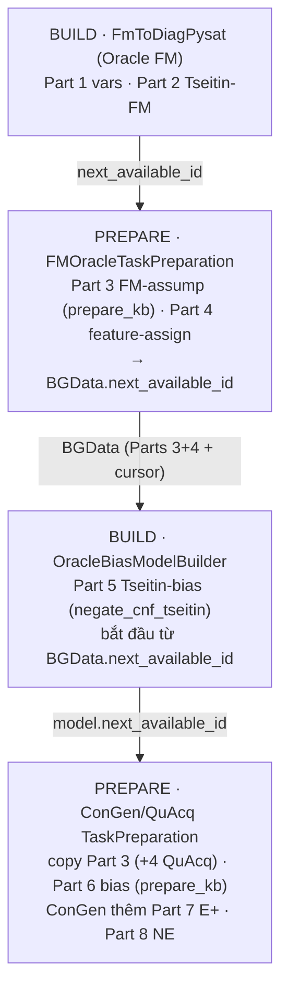

# Visual Explanation: Task Preparation — Assumption ID Layout (Parts)

> **Mấu chốt đã sửa:** Trục "Parts" trộn **2 PHA cấp phát ID**:
> - **SAT variables** (feature vars + Tseitin aux) — cấp ở **BUILD time** → Parts **1, 2, 5**.
> - **Assumption IDs** (literal để bật/tắt constraint, config, test case…) — cấp ở **PREPARE time** → Parts **3, 4, 6, 7, 8**.
>
> `prepare_kb` **CHỈ** sinh phần **assumption-ID của constraint** (Part 3 / Part 6). Nó **không** tạo Tseitin —
> Tseitin (Part 2/5) đã dựng sẵn ở build-time, `prepare_kb` chỉ *tham chiếu* (append guard `-assumption`).

## `prepare_kb` sinh ra cái gì? (task_preparation.py:285)

Với mỗi constraint trong `constraint_map`:

```
 INPUT:  constraint_map = {key: [clauses]},  negated_constraint_map (đã có Tseitin, build-time),  id_assumption

 OUTPUT, mỗi constraint:
   ① result.assumptions  += [original_id]                 ← assumption ID (1 số nguyên mới)
   ② result.set_kb       += [clause + [-original_id]] …    ← guarded CNF ("assumption ⇒ clause")
   ③ provider: description(original_id) = key
   ④ NẾU có negated_constraint_map & "NOT(key)":
        result.assumptions += [negated_id]                 ← assumption ID phủ định
        result.set_kb      += [neg_clause + [-negated_id]] ← neg_clause ĐÃ chứa Tseitin (build-time)
        result.negation_map[original_id] = negated_id
   → return id_assumption (ID trống kế tiếp)

 ⇒ Sinh ASSUMPTION IDs + guarded set_kb + negation_map.   KHÔNG sinh feature vars / Tseitin.
 ⇒ Layout đóng góp: [orig, neg, orig, neg, …] (paired) nếu có negated_map; còn lại [orig, orig, …] (single).
```

---

## Hai pha cấp phát ID (toàn cảnh)

```
 ┌─────────────────────────── BUILD TIME (SAT variables) ───────────────────────────┐
 │  Part 1: feature var IDs (1..n)                  ← FmToDiagPysat                    │
 │  Part 2: Tseitin (negated FM constraints)        ← FmToDiagPysat / negate_cnf_tseitin│
 │  Part 5: Tseitin (negated BIAS constraints)      ← OracleBiasModelBuilder           │
 │          (bắt đầu từ Oracle.next_available_id, tức ngay sau Part 4)                 │
 └───────────────────────────────────────────────────────────────────────────────────┘
 ┌────────────────────────── PREPARE TIME (assumption IDs) ──────────────────────────┐
 │  Part 3: constraint assumptions      ← prepare_kb           (paired nếu có neg map) │
 │  Part 4: config / feature-assign     ← prepare_configuration / inline loop          │
 │  Part 6: bias assumptions            ← prepare_kb           (paired)                 │
 │  Part 7: E+ / test-case assumptions  ← prepare_testsuite_with_negation (paired)      │
 │  Part 8: NE + ¬NE                     ← GenerateNE + combine                          │
 └───────────────────────────────────────────────────────────────────────────────────┘
```

> Vì thế trên trục ID, Part 5 (Tseitin bias, build) nằm **giữa** Part 4 (Oracle prepare) và Part 6 (ConGen prepare):
> Oracle prepare xong 3–4 → bias-builder dựng Tseitin 5 → ConGen/QuAcq prepare 6+.

---

## 5 task preparation & Part nào mỗi cái sinh ra (PREPARE time)

| # | Class | Sinh ra (prepare time) | Tham chiếu (build time) |
|---|-------|------------------------|--------------------------|
| 1 | `DiagnosisTaskPreparation` | KB-assumptions (`prepare_kb`) + config/test_case (`prepare_configuration`) | vars + Tseitin (FmToDiagPysat) |
| 2 | `TestCaseTaskPreparation` | KB-assumptions (`prepare_kb`, single) + E+/E− (`prepare_testsuite_with_negation`) | vars (+Tseitin) |
| 3 | `FMOracleTaskPreparation` | **Part 3** FM-assumptions (`prepare_kb`) + **Part 4** feature-assign (inline) | **Part 1–2** |
| 4 | `ConGenTaskPreparation` | **Part 6** bias (`prepare_kb`) + **Part 7** E+ + **Part 8** NE · *copy Part 3* | **Part 5** Tseitin bias |
| 5 | `QuAcqTaskPreparation` | **Part 6** bias (`prepare_kb`) · *copy Part 3 + Part 4* | **Part 5** Tseitin bias |

*(`prepare_kb` xuất hiện ở #1, #2, #3, #4, #5 — luôn sinh phần **constraint-assumption**, không bao giờ sinh Tseitin.)*

### Strip layout từng loại (■ = build-time var, □ = prepare-time assumption)

```
DiagnosisTaskPreparation (explanation)
  ■Part1 vars  ■Part2 Tseitin │ □Part3 KB-assump(single|paired*) · □Part4 config · □Part5 test_case
     * paired chỉ khi for_redundancy=True (prepare_kb nhận negated_constraint_map)

TestCaseTaskPreparation (explanation)
  ■Part1 vars  ■Part2 Tseitin │ □Part3 KB-assump(single) · □E+ paired · □E− paired

FMOracleTaskPreparation (conacq Oracle)
  ■Part1 vars  ■Part2 Tseitin │ □Part3 FM-assump(paired, prepare_kb) · □Part4 feature-assign(pos/neg)
     → xuất BGData (root pair của Part3 + toàn bộ Part4 + next_available_id)

ConGenTaskPreparation (conacq)
  [copy □Part3 BG]  ■Part5 Tseitin-bias(build) │ □Part6 bias(paired, prepare_kb) · □Part7 E+ · □Part8 NE

QuAcqTaskPreparation (conacq)
  [copy □Part3 + □Part4 BG]  ■Part5 Tseitin-bias(build) │ □Part6 bias(paired, prepare_kb)   (KHÔNG E+/E-)
```

---

## Dòng thời gian pipeline conacq (ai cấp Part nào, khi nào)



---

## Key Concepts (đã sửa hoàn chỉnh)

1. **`prepare_kb` = nhà máy assumption-ID cho CONSTRAINT.** Sinh `result.assumptions` (orig [+neg]) +
   `result.set_kb` (guarded) + `negation_map`. **Không** sinh feature vars, **không** sinh Tseitin.

2. **2 pha:** SAT vars (Parts 1,2,5) ở **build**; assumption IDs (Parts 3,4,6,7,8) ở **prepare**.
   `next_available_id` là con trỏ chuyển pha giữa từng chặng.

3. **"Paired" = orig+neg assumption**, do `prepare_kb`/`prepare_testsuite_with_negation` sinh — chỉ khi có
   negated map / negation. Negated *clause* thì dùng Tseitin (build-time); negated *assumption ID* mới là cái prepare_kb cấp.

4. **explanation = self-contained** (Parts 3–5 trong 1 preparation); **conacq = pipeline** (Parts 3–8 trải qua
   build→prepare→build→prepare, nối bằng `BGData.next_available_id`). ConGen/QuAcq **copy** Part 3, không tự sinh.

5. **Bất đối xứng kế thừa:** chỉ 3/5 implement ABC (Diagnosis, TestCase, ConGen); QuAcq chỉ mixin, FMOracle đứng riêng.

---

*Source (đã verify):* `explanation/models/task_preparation.py:285` (`prepare_kb`)
· `explanation/transformations/fm_to_diag_pysat.py:98` (Part 1–2 Tseitin build)
· `explanation/models/abstract_model_builder.py:101` (Part 5 Tseitin-bias build)
· `conacq/oracle/fm_oracle_model.py:157` · `conacq/algorithms/acqmss/task_preparation.py:53`
· `conacq/algorithms/quacq/task_preparation.py:78` · `conacq/oracle/bg_data.py`
